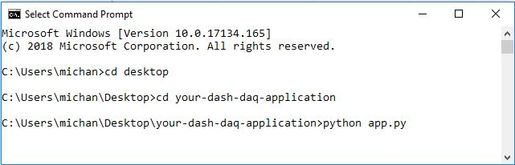
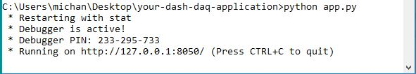
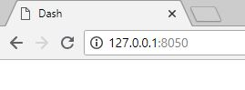
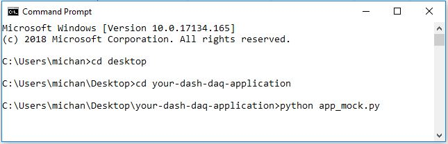
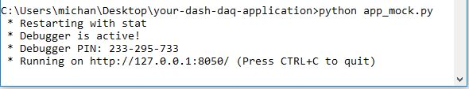

# Dash-SilverPak17C-Stepper-Motor

## Introduction
An application that allows the user to control the speed and absolute positioning of a Lin Engineering [SilverPak17C Stepper Motor](https://www.linengineering.com/products/integrated_motors/silverpak-17c-2/). [Play with the demo](https://dash-daq-stepper-motor.herokuapp.com/) and learn more about this application from our [blog entry](https://www.dashdaq.io/stepper-motor-control-in-python).


### Brushed DC Motor (Stepper Motor)
When DC voltage is applied to one of these coils, a magnetic field is produced, due to [electromagnetic induction](https://en.wikipedia.org/wiki/Electromagnetic_induction). This field can either attract or repel the magnitized gear depending on the direction of current flowing through the coils, which can best be understood through [Lenz Law](https://en.wikipedia.org/wiki/Lenz%27s_law). The job of the magnetic field is to rotate and align the magntic gear, with the produced magnetic field (coil). This movement is known as a step. The direction of current flow is controled by a driver, which directs current/voltage to the coils based on the demand of the user. The coils act synchonously, in groups called phases, that can be directed by the driver to move to precise locations, or rotational speeds. For a further understanding read more [here](https://en.wikipedia.org/wiki/Stepper_motor)


### dash-daq
[Dash DAQ](http://dash-daq.netlify.com/#about) is a data acquisition and control package built on top of Plotly's [Dash](https://plot.ly/products/dash/). It gives users more accesibility and, key features for data aquistion applications.

## Requirements
It is advisable	to create a separate conda environment running Python 3 for the app and install all of the required packages there. To do so, run (any version of Python 3 will work):

```
conda create -n	[your environment name] python=3.6.4
```
```
source activate [your environment name]
```

To install all of the required packages to this conda environment, simply run:

```
pip install -r requirements.txt
```

and all of the required `pip` packages,  will be installed, and the app will be able to run.
 
## How to use the app
There are two versions of this application. A mock version for the user to play with, without any instruments connected, and a local version, that can be connected to a device.

### Local Application
If you would like to run the **local version**, please ensure the stepper motor is plugged into the USB 485 converter card, that the USB 485 converter card is plugged into the PC, and voltage (12 VDC - 40 VDC) is being run to the stepper motor. If this is your first time using the stepper motor you may need to install the drivers to use the USB 485 converter card. Instructions and the necessary files can be found [here](http://www.linmotors.com/Accessories/USB485.aspx) under downloads. 

When the drivers are properly installed you will see something like this highlighted port:

When the device is ready run in the command line:
``` 
python app.py
```


and you should see this:



Open the web address given to you in your browser and the application will be ready for use:



If the app is run, but the device is not connected you will see something like this:


Sometimes the application may freeze and hang due to the serial communication. You can fix this by:
1. Unplugging all connections and plugging them back in
2. Correct **COM PORT/PATH** is selected
3. Proper voltage is applied to the motor (12 VDC - 40 VDC)
4. The ground wire from the USB485, stepper motor, and power supply are connected

### Mock Application
If you would like to run the __**mock version**__, run in the command line:

```
python app_mock.py 
```



and you should see this:



Open the web address given to you in your browser and the application will be ready for use:


### Controls
* Dark Theme: Boolean switch located in the banner, allows the user to switch to the dark theme.
* Color Picker: Changes colors of components and banner.
* Acceleration: Sets rate to get to specified velocity in microsteps/second^2.
* Address: The port address, set on the reciever and sender.
* Baudrate: The rate at which data is sent through serial communication. This should be same for reciever and sender.
* Port: Sets the port in the global variable version of the application.  
* Motor Current: The percentage of max current to run the motor at.
* Hold Current: The percentage of max current to hold the motor in idle.
* Step Size: The resolution in microsteps of the full step size.
* Position Mode (Graph): The absolute positioning of the motor, in position mode. 
* Revolutions Per Second: The amount of rotations per second in velocity mode.
* Not Set/Set: Sends a command through PySerial, setting the stepper motors, acceleration, address, baudrate, port, motor current, hold current, and step size.
* Stop: Terminates any commands running, and flushes the serial port.
* Velocity (Switch): Sets the motor to velocity mode.
* Position: (Switch): Sets the motor to position mode.
* Velocity (Steps): The velocity of the motor in microsteps/second.
* Position (Degree): The absolute positioning of the motor based on it's initial starting point as 0 degrees.


## Resources
PySerial was used for serial communication. The API for PySerial can be found [here](http://pyserial.readthedocs.io/en/latest/pyserial_api.html). More detail and information on the commands that the stepper motor can take can be found in the [Lin Engineering documentation](https://www.linengineering.com/wp-content/uploads/downloads/Silverpak_17C/documentation/R256%20and%20Silverpak17C-CE%20Commands%20Manual.pdf). For a better understanding of this motor read the motor manual [here](https://www.linengineering.com/wp-content/uploads/downloads/Silverpak_17C/documentation/Silverpak17C-CE%20Manual.pdf)


